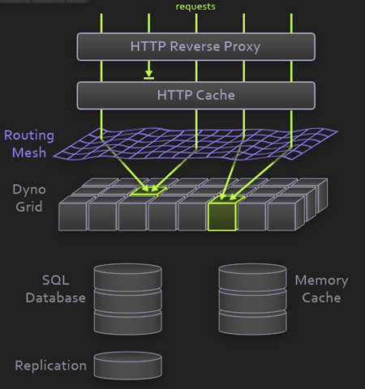

!SLIDE bullets
# Heroku Toolbelt

* http://heroku.com

!SLIDE small
# Créez une application Heroku et déployez la

    heroku create <my-cool-app-name> --stack cedar
    git push heroku -u master

!SLIDE
# THIS IS IT

!SLIDE
# Plus concrètement

